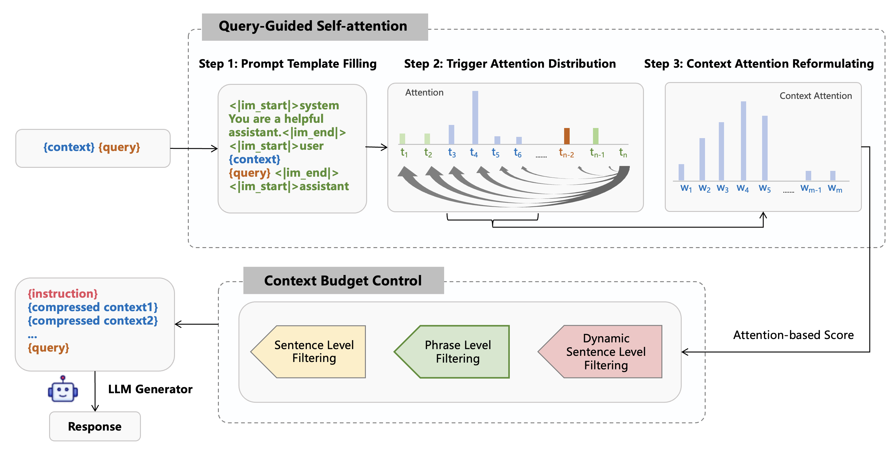
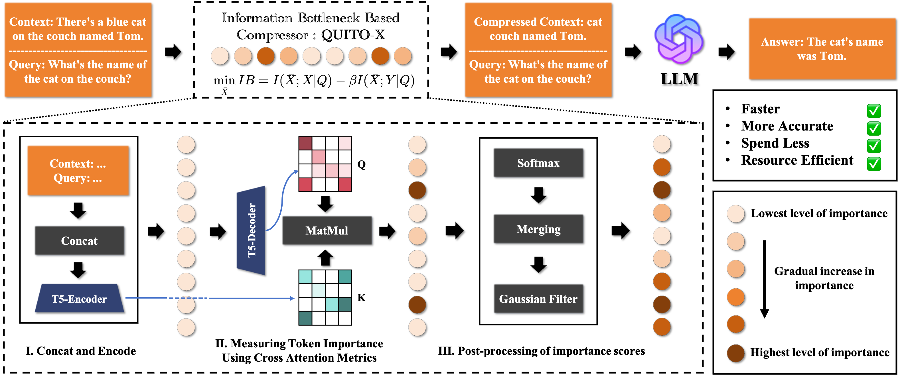

<h1 align="center">
QUITO & QUITO-X: Query-Guided Context Compression for Long-Context Reasoning
</h1>

<p align="center">
  <a href="https://arxiv.org/abs/2408.00274">📘 QUITO (CCIR 2024)</a> |
  <a href="https://arxiv.org/abs/2408.10497">🧠 QUITO-X (EMNLP 2025 Findings)</a>
</p>

---

# 🔍 Overview
This repository provides the **official implementation** for **QUITO** and **QUITO-X**, two complementary works on **query-guided context compression** for accelerating long-context reasoning in large language models (LLMs).

- **QUITO (CCIR 2024)** proposes a lightweight attention-based method to filter irrelevant context based on query attention.  
- **QUITO-X (EMNLP 2025 Findings)** extends this idea with a principled information-theoretic view, formulating compression as an **Information Bottleneck (IB)** optimization problem.

Both methods aim to retain essential information while significantly reducing context length — improving **efficiency** without sacrificing **reasoning quality**.

---

# 🧭 QUITO (CCIR 2024)

**Title:** *QUITO: Accelerating Long-Context Reasoning through Query-Guided Context Compression*  
**Conference:** CCIR 2024  
**Authors:** Wenshan Wang, Yihang Wang, Yixing Fan, Huaming Liao, Jiafeng Guo  
**Paper:** [arXiv:2408.00274](https://arxiv.org/abs/2408.00274)

**Overview:**  
QUITO computes the attention of the query over the context tokens and filters out low-attention regions, effectively compressing the context before feeding it into the main LLM.

<p align="center">
  
</p>

---

# 🧩 QUITO-X (EMNLP 2025 Findings)

**Title:** *QUITO-X: A New Perspective on Context Compression from the Information Bottleneck Theory*  
**Conference:** EMNLP 2025 Findings  
**Authors:** Wenshan Wang, Yihang Wang, Yixing Fan, Huaming Liao, Jiafeng Guo  

**Overview:**  
Building upon QUITO, QUITO-X introduces an **Information Bottleneck (IB)** perspective to formalize the compression–relevance trade-off:
  
> Maximize information retained about the query while minimizing redundant information from the context.

The method further introduces **mutual information–guided adaptive filtering**, achieving a balance between efficiency and task-specific informativeness.

<p align="center">
  
</p>

---

# ⚙️ Features

- 🔧 **Plug-and-play** context compression for Hugging Face models  
- 🧠 **Query-guided attention filtering** (word, sentence, token levels)  
- ⚙️ **Unified interface** for both causal and encoder–decoder models  
- 💨 **Cross-device support:** CUDA, MPS (Apple Silicon), and CPU  
- 🧩 **Adjustable smoothness** via `sigma` parameter  
- 📉 **High compression efficiency** with minimal information loss  

---

# 🎯 Quick Start
## 1️⃣ Installation

```bash
git clone https://github.com/Wenshansilvia/attention_compressor
cd attention_compressor/
pip install -r requirements.txt
```

## 2️⃣ Basic Usage — Causal Models (e.g., Qwen, LLaMA, GPT-2)

```python
from quito.compressor import Compressor

compressor = Compressor('Qwen/Qwen2-0.5B-Instruct')
# Use Phrase Level Filtering 
compressed_context = compressor.compress(doc="", query="", ratio=0.5)

# Or use Sentence Level Filtering
compressed_context = compressor.compress_sentence(doc="", query="", ratio=0.5)

# Or use Dynamic Sentence Level Filtering
compressed_context = compressor.compress_sentence_token(doc="", query="", ratio=0.5)
```

## 3️⃣ Encoder–Decoder Models (e.g., T5, FLAN-T5, BART)

```python
from quito.compressor import T5Compressor

t5_compressor = T5Compressor('t5-small', sigma=1.0)

compressed_context = t5_compressor.compress(
    doc="Artificial intelligence is evolving rapidly.",
    query="Summarize the main idea.",
    ratio=0.4,
    word=True
)
```


# 📌 Citation

If you find the repository or paper helpful, please cite our work:

```
@article{wang2024quito,
 author = {Wang, Wenshan and Wang, Yihang and Fan, Yixing and Liao, Huaming and Guo, Jiafeng},
 journal = {arXiv preprint arXiv:2408.00274},
 title = {QUITO: Accelerating Long-Context Reasoning through Query-Guided Context Compression},
 year = {2024}
}

@article{wang2024quitox,
 author = {Wang, Yihang and Huang, Xu and Tian, Bowen and Su, Yueyang and Yu, Lei and Liao, Humming and Fan, Yixing and Guo, Jiafeng and Cheng, Xueqi},
 journal = {arXiv preprint arXiv:2408.10497},
 title = {QUITO-X: A New Perspective on Context Compression from the Information Bottleneck Theory},
 year = {2024}
}
```


